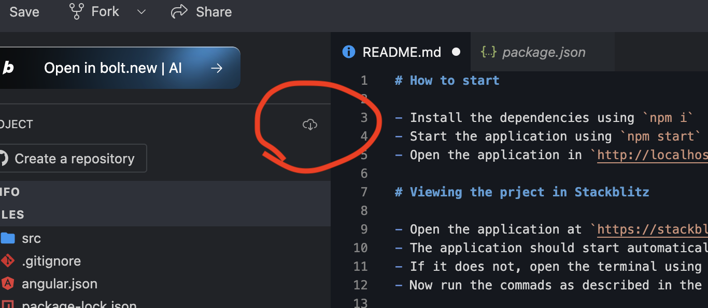

# How to start

- Install the dependencies using `npm i`
- Start the application using `npm start`
- Open the application in `http://localhost:4200/`

# Viewing the prject in Stackblitz

- Open the application in Chrome at `https://stackblitz.com/edit/stackblitz-starters-wv4vor67`
- The application should start automatically
- If it does not, open the terminal using `` Ctrl +`  ``
- Now run the commads as described in the "How to start" section

Code can be downloaded by clicking on the "Download Project" button

# Github link

[Github](https://github.com/saurajit/angular-demo)

[File of interest](https://github.com/saurajit/angular-demo/blob/master/src/components/deadline/deadline.ts)